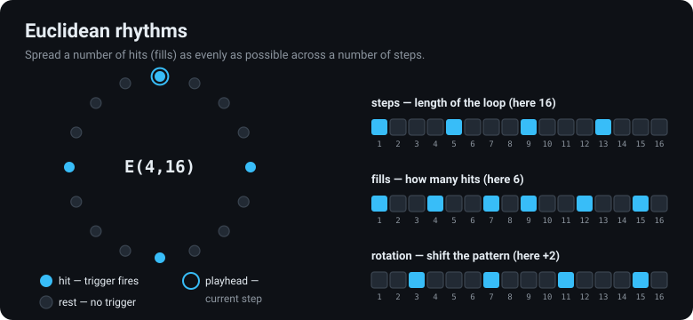
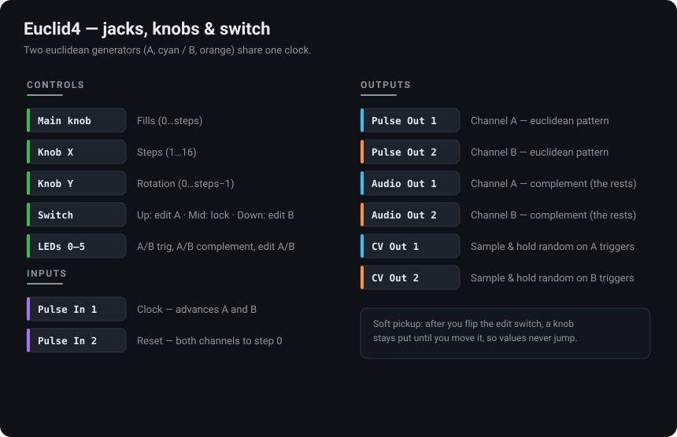
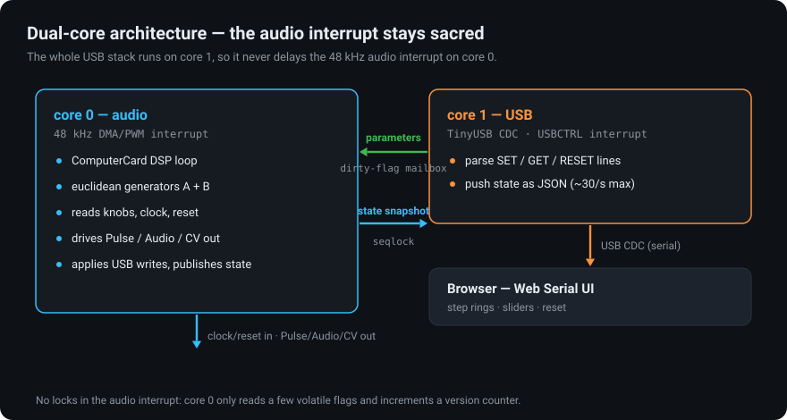

# Euclid4 — Workshop Computer euclidean generator

[](https://github.com/heim/workshop-computer-euclid/actions/workflows/build.yml)
[](https://heim.github.io/workshop-computer-euclid/)

Firmware for a [Music Thing Modular Workshop System Computer](https://www.musicthing.co.uk/workshopsystem/)
program card (RP2040), built on Chris Johnson's header-only
[ComputerCard](https://github.com/TomWhitwell/Workshop_Computer) library.

Euclid4 runs **two independent euclidean rhythm generators** (A and B) that share
one clock. Between them they drive **four trigger tracks** plus **two sample-and-hold
random CVs**. It works completely standalone — and when you plug in USB it also
speaks a small serial protocol, so the included **browser control panel** can show
both patterns live and edit every parameter. USB runs on the RP2040's second core,
so it never disturbs the 48 kHz audio engine on the first.

> ▶ **Try the control panel in your browser:** **<https://heim.github.io/workshop-computer-euclid/>**
> (Chrome / Edge / Opera → **Connect** → pick the card's serial port)


---

## Contents

- [Install on a card](#install-on-a-card)
- [How the card works](#how-the-card-works)
- [Editing patterns from the module](#editing-patterns-from-the-module)
- [USB control &amp; the web UI](#usb-control--the-web-ui)
- [Serial protocol reference](#serial-protocol-reference)
- [Building from source](#building-from-source)
- [How it stays glitch-free (design notes)](#how-it-stays-glitch-free-design-notes)
- [Repository layout](#repository-layout)
- [Credits](#credits)

---

## Install on a card

The firmware is a single `.uf2` file that you write to a program card in the
Workshop Computer's card slot — no programmer or soldering required. Program cards
are **not** write-protected, so a blank card and a printed card (a Reverb+, say)
are written exactly the same way; just double-check you've inserted the card you
mean to overwrite.

### Option A — download the prebuilt firmware (recommended)

1. **Download** the latest `euclid4-vX.Y.Z.uf2` from the
   [**Releases**](https://github.com/heim/workshop-computer-euclid/releases) page.
2. **Reveal the top button.** Pull off the **main knob** at the top of Computer
   (stiff the first time, then easier). Recessed into the panel behind it is a small
   button — this is the boot (BOOTSEL) button.
3. **Insert the target card** into the program-card slot and check it's the right one.
4. **Connect a USB-C cable** from Computer's front-panel USB port to your machine,
   then **power-cycle the Workshop System** so the Computer connects over USB.
5. **Enter bootloader mode:** hold down the **top button** (behind the knob), then
   **tap and release the bottom button** next to the card slot, and let go of the top
   button. A drive called **`RPI-RP2`** appears on your desktop. (If it doesn't, turn
   the Workshop System off and on and try again.)
6. **Copy the firmware:** drag `euclid4-vX.Y.Z.uf2` onto the `RPI-RP2` drive. The
   drive disappears and the card reboots running Euclid4.

That's it — the card is ready to patch. USB is optional; see
[USB control](#usb-control--the-web-ui) below.

> New to writing Workshop System cards? Music Thing has a ~3-minute walkthrough on
> the [Workshop System page](https://www.musicthing.co.uk/workshopsystem/).

### Option B — build it yourself

If you'd rather compile the firmware, see [Building from source](#building-from-source).
The build produces the same `euclid.uf2`, which you write with steps 2–6 above.

---

## How the card works

### Euclidean rhythms in one picture

A euclidean rhythm spreads a number of hits (**fills**) as evenly as possible over
a number of **steps**. `E(4, 16)` places 4 hits across 16 steps; `E(5, 8)` gives you
the classic *tresillo*. **Rotation** shifts where the pattern starts. Each channel
has its own steps, fills and rotation.



On every clock pulse the channel advances one step. If the current step is a **hit**,
the channel fires a trigger; if it is a **rest**, it does nothing (and the *complement*
output fires instead — see below).

### Inputs, outputs and controls

Two generators, **A** (cyan) and **B** (orange), share one clock. Each one produces
three things: the pattern itself, its complement, and a random CV.



| Jack / control  | Function                                                       |
|-----------------|----------------------------------------------------------------|
| **Pulse In 1**  | External clock — advances A and B (overrides the internal clock while running) |
| **Pulse In 2**  | Reset — rising edge sends both channels to step 0             |
| **Pulse Out 1** | Channel **A** euclidean pattern (10 ms triggers)              |
| **Pulse Out 2** | Channel **B** euclidean pattern                               |
| **Audio Out 1** | Channel **A** *complement* — fires on the steps that are rests |
| **Audio Out 2** | Channel **B** complement                                      |
| **CV Out 1**    | Sample &amp; hold random voltage, renewed on each **A** trigger   |
| **CV Out 2**    | Sample &amp; hold random voltage, renewed on each **B** trigger   |
| **Main knob**   | Fills (0…steps) for the selected channel                      |
| **Knob X**      | Steps (1…16) for the selected channel                         |
| **Knob Y**      | Rotation (0…steps−1) for the selected channel                 |
| **Switch**      | Up = edit A · Middle = edit B · Down = tap tempo (internal clock) |
| **LEDs 0–3**    | A trigger · B trigger · A complement · B complement           |
| **LEDs 4–5**    | 4 = editing A, 5 = editing B; both flash on each tempo tap    |

**The four trigger tracks.** Each channel gives you *two* rhythms for free: the
pattern on its Pulse output, and its **complement** (every step that is *not* a hit)
on its Audio output. Patch the pattern to a kick and the complement to a hat and a
single channel already fills out a groove.

**Two random CVs.** On each trigger the channel samples a new pseudo-random voltage
and holds it until the next trigger — great for modulating pitch, filter cutoff or
anything else that should change in lock-step with the rhythm.

---

## Editing patterns from the module

The **switch** has three positions:

- **Up** — edit channel A (LED 4 lights)
- **Middle** — edit channel B (LED 5 lights)
- **Down** — tap tempo (see below); the knobs don't edit here

While editing (Up or Middle), the three knobs set **Fills** (Main), **Steps** (X)
and **Rotation** (Y) for that channel.

**Soft pickup.** When you flip the switch to the other channel, the knobs don't
snap that channel's values to wherever the knobs happen to be sitting. Each knob
stays inactive until you actually move it, then it takes over smoothly. This lets
you flip between A and B without values jumping.

### Clock &amp; tap tempo

Euclid4 has its own internal clock, and it also follows an external one:

- **Tap tempo** — with the switch **Down**, flick it down in time with the beat.
  Two or more taps set the internal step rate (each flick nudges the clock in
  phase, and LEDs 4/5 blink on every tap). The internal clock free-runs, so the
  card plays standalone with no patching.
- **External clock** — patch a clock into **Pulse In 1** and it takes over
  automatically; the internal clock steps back in while external pulses are
  arriving and resumes if they stop. **Pulse In 2** still resets both channels.

---

## USB control &amp; the web UI

Plug the Computer into a computer over USB and it enumerates as a standard USB
serial (CDC) device. You can talk to it with any serial terminal, or use the
included web page for a live graphical control panel.

### The web control panel

The panel is hosted on GitHub Pages — just open it:

**<https://heim.github.io/workshop-computer-euclid/>**

It is a single static page ([`web/index.html`](web/index.html)) with no build step
and no server, so you can equally run it straight from the filesystem (`file://`)
after cloning.

1. Open it in a **Chromium-based desktop browser** — Chrome, Edge or Opera. It uses
   the [Web Serial API](https://developer.mozilla.org/en-US/docs/Web/API/Web_Serial_API),
   which Firefox and Safari do not support; the page shows a clear message if your
   browser can't run it.
2. Click **Connect** and pick the card's serial port.
3. The page reads the card's current state and mirrors it. Each channel shows a
   **step ring** — filled dots are hits, and a highlighted marker follows the live
   playhead as the clock runs.
4. Drag the sliders (or use the ± buttons) to change steps, fills and rotation; the
   commands are sent instantly. Turning the physical knobs updates the page too.
5. **Reset** returns both channels to step 0.

Everything is echoed back from the card, so the module and the browser always agree —
whoever changed a value last wins.

---

## Serial protocol reference

Line-based text, **one command per line, `\n`-terminated**. The baud rate is
irrelevant (it's USB CDC). Send these from `screen`, `minicom`, `pyserial`, or the
web UI:

| Command                              | Effect                                          |
|--------------------------------------|-------------------------------------------------|
| `SET <A\|B> <steps\|fills\|rot> <n>` | Set one parameter of one channel                |
| `GET`                                | Reply with the full state as one JSON line      |
| `RESET`                              | Send both channels back to step 0               |

The card also **pushes** its state unsolicited: the same JSON line is emitted on
every change (each clock pulse, and each edit from a knob or over USB), throttled to
about 30 messages per second so a fast clock can't flood the link. This is what lets
the web UI animate.

State line format:

```json
{"fw":"v1.1.0","a":{"steps":16,"fills":4,"rot":0,"pattern":4369,"step":3},"b":{"steps":16,"fills":7,"rot":3,"pattern":42314,"step":3}}
```

- `fw` is the firmware version (the release tag it was built from, or `dev`). The
  web UI shows it so you can tell whether the card matches the latest release.
- `pattern` is a bitfield — bit *i* set means step *i* fires (bit 0 is step 1).
- `step` is the current 0-based playhead position.

**Validation:** `steps` 1–16, `fills` 0–steps, `rot` 0–steps−1. Values are clamped
to the current step count where needed; out-of-range or malformed lines are ignored
silently. Knobs and USB can both change a parameter — the last write wins.

### Try it with a terminal

```sh
# macOS / Linux — replace with your port (e.g. /dev/ttyACM0 or /dev/tty.usbmodemXXXX)
screen /dev/ttyACM0
# then type, each followed by Enter:
GET
SET A steps 8
SET A fills 3
SET B rot 2
RESET
```

JSON lines stream back as the clock runs. Quit `screen` with `Ctrl-A` then `K`.

---

## Building from source

### Prerequisites

- The [Pico SDK](https://github.com/raspberrypi/pico-sdk) 2.x (CI builds against
  **2.3.0**), **with the TinyUSB submodule**:
  ```sh
  git clone --branch 2.3.0 https://github.com/raspberrypi/pico-sdk
  cd pico-sdk && git submodule update --init lib/tinyusb
  export PICO_SDK_PATH=$PWD
  ```
- `arm-none-eabi-gcc` and CMake ≥ 3.13.
- `firmware/ComputerCard.h` is already vendored. To refresh it, copy the latest from
  `Demonstrations+HelloWorlds/PicoSDK/ComputerCard/ComputerCard.h` in the
  [Workshop_Computer repo](https://github.com/TomWhitwell/Workshop_Computer), which
  also ships a VS Code DevContainer with the SDK, toolchain and flash/debug tasks.

### Build

```sh
cmake -S firmware -B firmware/build -DCMAKE_BUILD_TYPE=Release
cmake --build firmware/build --parallel
```

This produces `firmware/build/euclid.uf2`. Write it to a card as described in
[Install on a card](#install-on-a-card).

### Automated builds &amp; releases

Every push and pull request builds the firmware in GitHub Actions
([`.github/workflows/build.yml`](.github/workflows/build.yml)) and uploads the
`.uf2` as a build artifact.

Releases are cut by a separate workflow
([`.github/workflows/release.yml`](.github/workflows/release.yml)) that builds the
firmware, creates the tag and **GitHub Release** server-side, attaches
`euclid4-<version>.uf2`, and writes install notes plus an auto-generated changelog.
Run it any of these ways:

- **Actions tab → “release” → Run workflow.** Pick a `bump` (patch / minor / major);
  the next version is computed from the latest release. Optionally set an explicit
  `version` or mark it a pre-release.
- **Push a tag:** `git tag v1.1.0 && git push origin v1.1.0`.

Because the whole thing runs on the Actions runner, a release needs nothing more
than triggering that workflow — no local tag push or manual upload required.

---

## How it stays glitch-free (design notes)

`ComputerCard::Run()` blocks core 0 and runs the entire DSP inside a 48 kHz interrupt
there. Euclid4 therefore puts the **whole USB stack (raw TinyUSB CDC) on core 1** via
`multicore_launch_core1()`. The USB interrupt fires on core 1; the audio DMA/PWM
interrupts stay on core 0. They never contend, so USB traffic can never delay a
trigger.



`pico_stdio_usb` was deliberately avoided — it services TinyUSB from a timer in the
default alarm pool, which lives on core 0 and would compete with the audio interrupt.
Raw TinyUSB on core 1 keeps the two cores cleanly separated.

Data crosses between the cores **without any locks in the audio interrupt**:

- **core 1 → core 0 (parameter writes):** a per-parameter *dirty-flag mailbox*. Core 1
  writes the value then sets a flag; core 0 clears the flag *before* reading the value,
  so no update is ever lost.
- **core 0 → core 1 (published state):** a *seqlock*. Core 0 writes the snapshot
  between two increments of a version counter; core 1 re-reads if it sees a change.
  The writer — the audio interrupt — never waits.

The only work added to the audio interrupt is reading a few volatile flags, and (when
a parameter actually changes) recomputing a ≤16-step pattern and publishing a small
snapshot. Bounded, non-blocking, lock-free — the audio interrupt stays sacred.

---

## Repository layout

```
firmware/
  main.cpp            Euclid4 firmware (standalone DSP + USB CDC control on core 1)
  ComputerCard.h      Chris Johnson's ComputerCard library (vendored)
  tusb_config.h       TinyUSB device configuration (single CDC class)
  usb_descriptors.c   USB descriptors for the CDC device
  CMakeLists.txt      Pico SDK build script
web/
  index.html          Web Serial control panel (vanilla JS, dark theme, no build)
  screenshot.png      Screenshot of the panel
docs/                 Illustrations used in this README
.github/workflows/
  build.yml           CI build + tagged releases
```

---

## Credits

- **[ComputerCard](https://github.com/TomWhitwell/Workshop_Computer)** by Chris Johnson —
  the hardware abstraction that makes the jacks, knobs, switch and LEDs easy to use.
- **[Music Thing Modular Workshop System](https://www.musicthing.co.uk/workshopsystem/)**
  by Tom Whitwell — the hardware this runs on.
- Euclidean rhythms after Godfried Toussaint's *The Euclidean Algorithm Generates
  Traditional Musical Rhythms* (2005).
