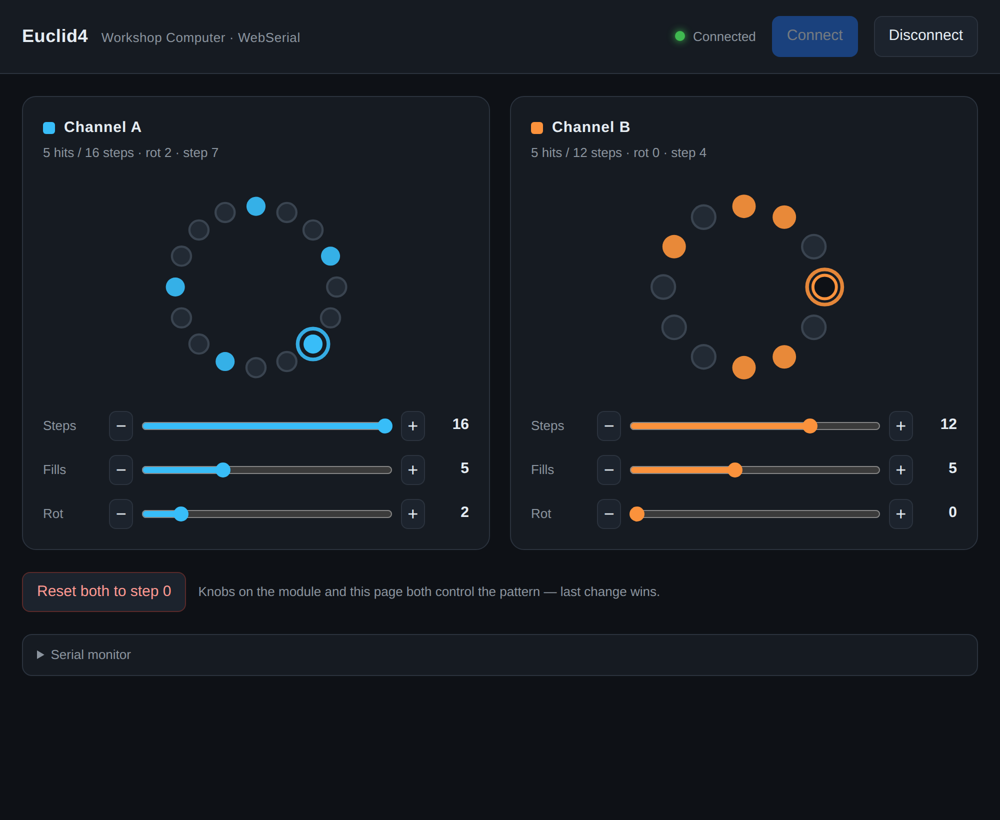

# Euclid4 — Workshop Computer euclidean generator with USB/web control

Firmware for a [Music Thing Modular Workshop System Computer](https://www.musicthing.co.uk/workshopsystem/)
program card (RP2040), built on Chris Johnson's header-only
[ComputerCard](https://github.com/TomWhitwell/Workshop_Computer) library.

Two independent euclidean generators (A and B) drive four trigger tracks, plus
two sample-and-hold random CVs. The card works **standalone** exactly as before,
and now additionally exposes a **USB-serial control protocol** and a companion
**Web Serial** UI so you can watch both patterns live and edit all six parameters
from a browser — without a single audio glitch, because the USB stack lives on
core1 and never touches the 48 kHz audio interrupt on core0.



## Repository layout

```
firmware/
  main.cpp            Euclid4 firmware (standalone DSP + USB CDC control on core1)
  ComputerCard.h      Chris Johnson's ComputerCard library (v0.3.x, downloaded)
  tusb_config.h       TinyUSB device config (single CDC class)
  usb_descriptors.c   USB descriptors for the CDC device
  CMakeLists.txt      Build script (Pico SDK)
web/
  index.html          Static Web Serial UI (vanilla JS, dark theme, no build step)
  screenshot.png      Screenshot of the UI
README.md
```

## What the card does

| Jack / control  | Function                                                        |
|-----------------|-----------------------------------------------------------------|
| Pulse In 1      | Clock (external, shared by A and B)                            |
| Pulse In 2      | Reset (rising edge → both channels to step 0)                  |
| Pulse Out 1 / 2 | Channel A / B euclidean pattern                                |
| Audio Out 1 / 2 | Channel A / B complement (the steps that do *not* fire)        |
| CV Out 1 / 2    | S&H stepped random, re-sampled on each A / B trigger           |
| Main knob       | Fills (0..steps) for the selected channel                      |
| Knob X          | Steps (1..16) for the selected channel                         |
| Knob Y          | Rotation (0..steps-1) for the selected channel                 |
| Switch Up / Dn  | Edit channel A / B                                             |
| Switch Middle   | Locked (performance mode; knobs do nothing)                   |
| LED 0..3        | A-trig / B-trig / A-complement / B-complement                 |
| LED 4 / 5       | Edit-mode indicator (4 = A, 5 = B, both off = locked)         |

Knobs use **soft pickup**: after switching edit channel a knob is inactive until
moved, so values don't jump.

## Building the firmware

### Prerequisites

- [Pico SDK](https://github.com/raspberrypi/pico-sdk) (2.x; tested with 2.3.0),
  **with the TinyUSB submodule checked out**:
  ```sh
  git clone https://github.com/raspberrypi/pico-sdk
  cd pico-sdk
  git submodule update --init lib/tinyusb
  export PICO_SDK_PATH=$PWD
  ```
- `arm-none-eabi-gcc` toolchain and CMake ≥ 3.13.
- `ComputerCard.h` is already included in `firmware/`. To refresh it, copy the
  latest from `Demonstrations+HelloWorlds/PicoSDK/ComputerCard/ComputerCard.h`
  in the [Workshop_Computer repo](https://github.com/TomWhitwell/Workshop_Computer).

The Workshop_Computer repo also carries a VS Code **DevContainer** setup (see its
`.devcontainer/README.md`) that provides the SDK, toolchain, and flash/debug
tasks out of the box if you prefer that route.

### Build

```sh
cd firmware
mkdir build && cd build
cmake .. -DCMAKE_BUILD_TYPE=Release
make -j4
```

This produces `build/euclid.uf2`.

### Flash via BOOTSEL

1. Hold the **BOOTSEL** button on the Computer's Pico while plugging in USB
   (or while pressing the module's reset), so it enumerates as the
   `RPI-RP2` mass-storage drive.
2. Copy `euclid.uf2` onto that drive. The card reboots and runs the firmware.

The card runs identically to the standalone version whether or not USB is
connected — USB is purely additive.

## USB-serial control protocol

Once flashed, the card appears as a USB CDC serial port (e.g. `/dev/ttyACM0`,
`/dev/tty.usbmodemXXXX`, or a `COMx` port). It's a raw text protocol, **one
command per line, `\n`-terminated**. Baud rate is irrelevant (USB CDC).

| Command                              | Effect                                          |
|--------------------------------------|-------------------------------------------------|
| `SET <A\|B> <steps\|fills\|rot> <n>` | Set one parameter of one channel                |
| `GET`                                | Reply with the full state as a single JSON line |
| `RESET`                              | Both channels back to step 0                    |

State is also **pushed unsolicited** — the same JSON line is emitted on every
state change (clock pulse or edit), throttled to ~30 messages/sec so a fast
clock can't flood the link. This is what lets the web UI animate the playhead.

JSON reply / push format (one line):

```json
{"a":{"steps":16,"fills":4,"rot":0,"pattern":34952,"step":3},"b":{"steps":16,"fills":7,"rot":3,"pattern":29257,"step":3}}
```

- `pattern` is a bitfield: bit *i* set ⇒ step *i* fires. Bit 0 is step 1.
- `step` is the current (0-based) playhead position.

Validation: `steps` 1–16, `fills` 0–steps, `rot` 0–steps-1. Out-of-range or
malformed lines are ignored silently. Physical knobs and USB can both change a
parameter — **the last write wins**.

### Test it with `screen` / `minicom` before the web UI

```sh
# macOS / Linux, replace with your port
screen /dev/ttyACM0
# then type (each followed by Enter):
GET
SET A steps 8
SET A fills 3
SET B rot 2
RESET
```

You'll see JSON lines stream back as the clock runs. (`Ctrl-A` then `K` to quit
`screen`.) `minicom -D /dev/ttyACM0` works too. The firmware accepts lines ending
in `\n` and/or `\r`.

## Web UI

`web/index.html` is a single static page — no backend, no build step. It works
straight from the filesystem (`file://`) or from GitHub Pages.

1. Open it in a **Chromium-based desktop browser** — Chrome, Edge, or Opera.
   Web Serial (`navigator.serial`) is required; Firefox and Safari don't support
   it and the page shows a clear message telling you so.
2. Click **Connect** and pick the card's serial port.
3. On connect the page sends `GET` and syncs to the card's real state.
4. Each channel shows a **step ring** (filled dots = hits) with a marker that
   follows the live `step`, plus sliders and ± buttons for steps / fills /
   rotation. Every change sends a `SET` immediately.
5. **Reset** sends `RESET`. Turning the physical knobs updates the page too
   (state is pushed back) — last change wins.

Expand **Serial monitor** at the bottom to watch the raw traffic.

> Web Serial only runs in a [secure context](https://developer.mozilla.org/en-US/docs/Web/Security/Secure_Contexts).
> `https://` (GitHub Pages) and local `file://` both qualify.

## Design notes — why it doesn't glitch the audio

`ComputerCard::Run()` blocks core0 and runs the whole DSP inside a 48 kHz
interrupt on core0. The firmware therefore puts the **entire USB stack (raw
TinyUSB CDC) on core1** via `multicore_launch_core1()`. `USBCTRL_IRQ` fires on
core1; the audio DMA/PWM interrupts stay on core0. The two never contend for an
interrupt.

`pico_stdio_usb` was deliberately *not* used: it services `tud_task()` from a
timer in the default alarm pool, which lives on core0 and would compete with the
audio interrupt. Raw TinyUSB on core1 gives clean isolation.

Cross-core data is **lock-free** — no core ever takes a lock inside the audio
interrupt:

- **core1 → core0 (parameter writes):** a per-parameter *dirty-flag mailbox*.
  core1 writes the value then sets `dirty`; core0 (in the audio IRQ) clears
  `dirty` *before* reading the value, so no update is ever lost. All accesses are
  single aligned volatile stores fenced with `dmb`.
- **core0 → core1 (published state):** a *seqlock*. core0 writes the snapshot
  between two increments of a version counter; core1 reads and retries if the
  counter changed. The writer (audio IRQ) never waits.

The work added to the audio interrupt is tiny and bounded: read a few flags,
recompute a ≤16-step pattern only when a parameter actually changes, and publish
a small snapshot. No blocking, no locks — the audio interrupt stays sacred.
